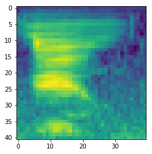

# SR-SNN
Speech Recognition using SNN

Datasets: https://github.com/Jakobovski/free-spoken-digit-dataset

Extracting MFSCs features 
This image is for the digit 0

To run:

uncompress the sr_params.zip file and then run the Classfication notebook
